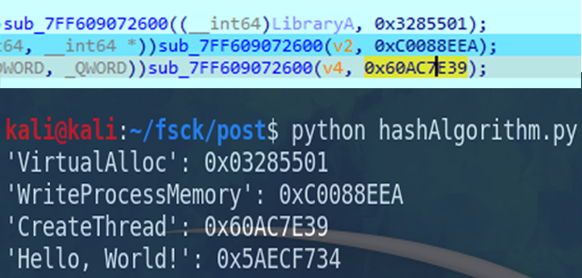
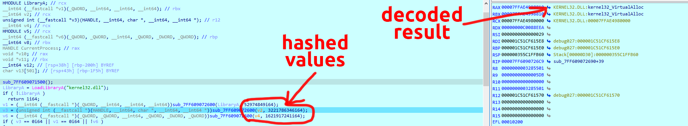

# <b>API-Hashing functions on C (Shellcode-Loader Example) </b>🔐


**API-Hashing** — This is a technique for statically hiding a function from the import address table and loading it during execution. The concept of work is quite trivial, the functions we need are hashed and their numeric types are substituted in the code, in my example I provided a ready-made version with automatic conversion, but you can delete these lines and substitute the variables with the calculated values ​​​​that are passed to the function, substitute the ready-made numeric hash format for its calculation and subsequent creation of a function prototype. After passing the hashed functions, our algorithm takes and calculates using the hashing algorithm inside the code and converts all function names into hash values ​​​​and compares them with the target hash, if the calculated hash matches, then its function name is returned, and then it gets the address of its function from the previously loaded kernel32 library and then, based on its created prototype, its functions are used to implement the loading of our shellcode

## 💻 Screens
<div align="center">
  
  
  
</div>

## 🛠️ Compile
```c
// code.c
14  unsigned char shellcode[] = {
    // Your shellcode buffer here . . .
    };
```
```bash
x86_64-w64-mingw32-gcc code.c -m64 -Os -flto -fdata-sections -ffunction-sections -Wl,--gc-sections -mwindows -s -o api_hash_loader.exe # linux-gcc
```